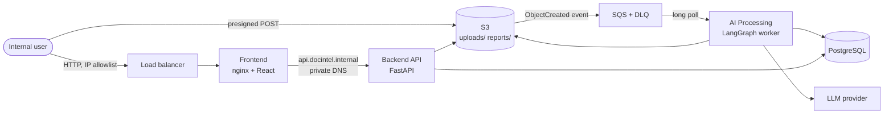

# Document Intelligence Platform

An internal AI document intelligence platform. Business users upload documents; the platform
classifies them, extracts structured information, validates it, flags what is missing, and
produces a report. Processing is asynchronous and event driven, orchestrated with LangGraph,
running on AWS ECS Fargate, provisioned entirely with Terraform.



The upload goes from the browser straight to S3. S3 emits the event, SQS delivers it, and the
worker produces the report. The user's connection is finished long before any of that starts,
and nothing can connect to the worker at all, because it has no listener.

## Where to read

| Document | What it is |
|---|---|
| [`docs/ARCHITECTURE.md`](docs/ARCHITECTURE.md) | The design, and the source of truth: end to end sequence, LangGraph workflow and state model, AWS service choices, event driven design, networking and private DNS, Terraform structure, ECS and Docker, frontend status updates, CI/CD, assumptions, trade offs, limitations, future work. The full architecture diagrams are in sections 1, 2, 4 and 8 |
| [`docs/BUILD_LOG.md`](docs/BUILD_LOG.md) | What was built in which order, how each part was verified with real output, every decision the architecture document did not cover, and every defect found along the way |
| [`docs/evidence/`](docs/evidence/README.md) | Output captured from real runs: the local end to end stack, the deployed AWS environment, and the CI deploy run |
| [`samples/`](samples/README.md) | The synthetic documents, what path each one exercises, and the reports a real model produced for them |

### Where each required item is documented

| The assignment asks for | Where |
|---|---|
| Overall solution architecture, and the architecture diagram | `ARCHITECTURE.md` section 1, and the diagram above |
| End to end document processing sequence | section 2 |
| LangGraph workflow design | section 4 |
| LangGraph state model | section 4, "State model" |
| Document classification approach | section 5 |
| Information extraction approach | section 5 |
| AWS infrastructure design | section 6 |
| Event driven processing design | section 7, with the status model in section 3 |
| Networking and private DNS design | section 8 |
| Terraform structure | section 9 |
| ECS and Docker design | section 10 |
| Frontend notification approach | section 11 |
| CI/CD design | section 12 |
| Key assumptions | section 13 |
| Architecture trade offs | section 14 |
| Known limitations, and what was simplified, why, the production approach and the limitation accepted | section 15 |
| Future improvements | section 16 |
| Deployment instructions for another engineer | this file, "Provision it on AWS" |
| Sample data for multiple types, success, different graph paths, missing information, failure, reports and history | [`samples/README.md`](samples/README.md), with real reports in `samples/reports/` |

## The three services

| Service | Runtime | Reachable from | Job |
|---|---|---|---|
| Frontend | nginx plus a React SPA, port 8080 | The load balancer | Upload, status, history, reports |
| Backend API | FastAPI, port 8000 | The frontend only, over private DNS | Intake, metadata, status, reports |
| AI Processing | Python plus LangGraph, no listener | Nothing | Consumes SQS, runs the graph, records the outcome |

## Repository layout

```
backend/    FastAPI service, SQLAlchemy models, Alembic migrations
worker/     AI processing service
              consumer/   SQS polling, claim, lease heartbeat, ack rules, reaper
              graph/      LangGraph nodes, routers, shared state
              rules/      deterministic logic: parsing, validation, masking
              llm/        provider selection, prompts, structured output schemas
frontend/   React plus Vite SPA, served by nginx
samples/    generator for the synthetic sample documents, and real reports for them
infra/      Terraform: bootstrap stack, then the main stack
.github/    ci.yml for pull requests, deploy.yml for the manually started deploy
docs/       architecture, build log, evidence
```

The four directories inside `worker/` are deliberate. They separate infrastructure event
handling, workflow orchestration, deterministic application logic, and LLM assisted
processing, which is a distinction the assignment asks for explicitly.

---

## Run it locally

Needs Docker and an OpenAI API key. The whole platform runs under compose with the AWS parts
emulated by LocalStack, so the real event path is exercised: browser to S3, S3 event to SQS,
SQS to the worker.

```bash
echo 'OPENAI_API_KEY=sk-...' > .env      # gitignored. compose reads it
docker compose up --build
open http://localhost:8080
```

Upload anything from `samples/out/`. `claim_form_complete.pdf` completes,
`claim_form_incomplete.pdf` completes with missing information, `restaurant_menu.pdf` is
declined as unsupported, and `corrupt_encrypted.pdf` fails. [`samples/README.md`](samples/README.md)
lists what every sample is for.

## Run the tests

Needs [uv](https://docs.astral.sh/uv/) and Docker. The tests drive the graph with a fake LLM,
so they need no API key and make no network call. The claim, the reaper and the ack rules are
tested against a real PostgreSQL, because the SQL is the thing under test.

```bash
docker compose up -d postgres            # listens on localhost:55432

# backend first: the worker's database tests create their schema by running the backend's
# Alembic migration, so there is exactly one definition of the table
(cd backend && uv sync --frozen --extra dev && uv run pytest -q && uv run ruff check . && uv run mypy .)
(cd worker  && uv sync --frozen --extra dev && uv run pytest -q && uv run ruff check . && uv run mypy .)
(cd frontend && npm ci && npm run build)
```

---

## Provision it on AWS

Everything is Terraform. Nothing is created by hand except one secret value, which is set by
one CLI command so that it never enters Terraform state.

### Prerequisites

- An AWS account, and a CLI profile for it. The commands below use `AWS_PROFILE=docintel`
  for Terraform and `--profile docintel` for the AWS CLI. Terraform has no `--profile` flag,
  and no profile is named in any provider block, because CI authenticates with OIDC.
- Terraform 1.10 or newer, Docker with arm64 builds (native on Apple silicon), the AWS CLI,
  and the GitHub CLI if you want the pipeline.
- Region `ap-southeast-1`. To change it, change `region` in both stacks and both backend files.

**Check Bedrock before anything else.** One call tells you which LLM mode you can deploy:

```bash
aws bedrock-runtime converse --model-id apac.amazon.nova-pro-v1:0 --region ap-southeast-1 \
  --messages '[{"role":"user","content":[{"text":"Reply with OK"}]}]' \
  --inference-config '{"maxTokens":5}' --profile docintel
```

If it answers, use the default `bedrock` mode. If it fails with
`ThrottlingException: Too many tokens per day`, the account's Bedrock quota is zero, which an
account with little usage history can have, and only AWS Support can raise it. Use the
`openai` fallback in the meantime. [`docs/BUILD_LOG.md`](docs/BUILD_LOG.md) has the full story
of that block on the account this was built in.

### Values to change for your own account

| File | Value |
|---|---|
| `infra/bootstrap/variables.tf` | `aws_account_id`, `github_repository`, `github_owner_id`, `github_repository_id`. The two ids come from `gh api repos/<owner>/<repo> --jq '.owner.id, .id'` |
| `infra/bootstrap/backend.hcl` and `infra/envs/dev.backend.hcl` | `bucket`, which is `docintel-tfstate-<account id>` |
| `infra/envs/dev.tfvars` | `aws_account_id`, and the three LLM lines at the bottom |

Both stacks pin `allowed_account_ids`, so an apply pointed at the wrong account fails before
it changes anything.

### 1. Bootstrap, once per account

Creates what has to exist before the main stack can be applied: the state bucket, the three
ECR repositories, the empty OpenAI key secret, and the GitHub OIDC provider with its two roles.

Its state lives in the bucket it creates. That is circular exactly once, on the very first
run, so the first run uses local state and then moves it in:

```bash
cd infra/bootstrap
mv backend.tf backend.tf.off                         # the bucket does not exist yet
AWS_PROFILE=docintel terraform init
AWS_PROFILE=docintel terraform apply
mv backend.tf.off backend.tf
AWS_PROFILE=docintel terraform init -migrate-state -backend-config=backend.hcl
```

On an account that is already bootstrapped, it is just
`terraform init -backend-config=backend.hcl`.

### 2. Set the OpenAI key (fallback mode only)

Terraform created the secret empty. The value goes in out of band, read from your `.env`
through a pipe so it never appears in a process list, in shell history or in state:

```bash
( set -a; . ./.env; set +a
  printf %s "$OPENAI_API_KEY" | aws secretsmanager put-secret-value \
    --secret-id docintel/openai-api-key --secret-string file:///dev/stdin \
    --profile docintel --region ap-southeast-1 )
```

Skip this in `bedrock` mode. The worker then holds no model credential at all.

### 3. Build and push the three images

The ECS services need an image to exist before their first deployment, which is why this
comes before the main stack. Images are arm64 and tagged with the git SHA. ECR tags are
immutable, so a tag always maps to exactly one commit.

```bash
TAG=$(git rev-parse --short=12 HEAD)
REG=<account id>.dkr.ecr.ap-southeast-1.amazonaws.com
aws ecr get-login-password --profile docintel --region ap-southeast-1 \
  | docker login --username AWS --password-stdin $REG
for s in frontend backend worker; do
  docker build --platform linux/arm64 --provenance=false -t $REG/docintel/$s:$TAG ./$s
  docker push $REG/docintel/$s:$TAG
done
```

### 4. Say who may reach it

The platform has no end user authentication, so the load balancer's IP allowlist is the
access control. It is machine specific, so it lives in a gitignored file:

```bash
cp infra/envs/dev.local.tfvars.example infra/envs/dev.local.tfvars
curl -s https://checkip.amazonaws.com      # put this address in the file, as a /32
```

Terraform refuses an empty list and refuses `0.0.0.0/0`.

### 5. Apply the main stack

```bash
cd infra
AWS_PROFILE=docintel terraform init -backend-config=envs/dev.backend.hcl
AWS_PROFILE=docintel terraform plan \
  -var-file=envs/dev.tfvars -var-file=envs/dev.local.tfvars \
  -var="image_tag=$TAG" -out=dev.tfplan
AWS_PROFILE=docintel terraform apply dev.tfplan
```

About 90 resources in about six minutes, most of it RDS. `terraform output app_url` is the
address to open.

### 6. Verify

```bash
aws ecs wait services-stable --cluster docintel-dev --services frontend backend worker \
  --profile docintel --region ap-southeast-1
aws elbv2 describe-target-health --profile docintel --region ap-southeast-1 \
  --target-group-arn "$(terraform output -raw frontend_target_group_arn)"
```

Then open `app_url` from an allowlisted address and upload a sample. If the page does not
load at all, your public address has probably changed: a security group drops the connection
silently, so it looks like a timeout and not like an error.

### Switching LLM mode

Three lines in `infra/envs/dev.tfvars`, then plan and apply. No code changes.

| | Target design | Fallback |
|---|---|---|
| `llm_provider` | `"bedrock"` | `"openai"` |
| `llm_model_id` | `"apac.amazon.nova-pro-v1:0"` | an OpenAI model name |
| `enable_nat` | `false` | `true` |
| What changes | Bedrock VPC endpoint, IAM permissions on the inference profile, no internet route anywhere | NAT gateway on the worker's route table only, access to the OpenAI secret, no Bedrock permissions |

`llm_provider = "openai"` with `enable_nat = false` fails at plan time, because it would
deploy a worker that cannot reach its model.

---

## Deploy through the pipeline

Two workflows. [`docs/ARCHITECTURE.md`](docs/ARCHITECTURE.md) section 12 explains the design.

| Workflow | Trigger | AWS role | What it does |
|---|---|---|---|
| `ci.yml` | every pull request | read only | Lint, types and tests for both Python services against a real PostgreSQL, the frontend build, three image builds with no push, and `terraform fmt`, `validate` and `plan`, with the plan posted on the pull request |
| `deploy.yml` | started by hand, from `main` only | deploy | Publishes the three images under the git SHA, applies Terraform with that tag, waits for the services to be stable, checks each service runs the published image, and checks the target is healthy |

**The deploy workflow never runs on its own.** It has no `push` trigger and takes no `ref`
input, its jobs run in a GitHub environment restricted to `main`, and the deploy role's trust
policy accepts only that environment's OIDC subject. Merging starts nothing.

One time setup, after the bootstrap stack exists:

```bash
R=<owner>/<repo>
gh api -X PUT repos/$R/environments/dev --input - <<'EOF'
{"deployment_branch_policy":{"protected_branches":false,"custom_branch_policies":true}}
EOF
gh api -X POST repos/$R/environments/dev/deployment-branch-policies -f name=main -f type=branch
gh variable set AWS_CI_PLAN_ROLE_ARN   -R $R --body "$(terraform -chdir=infra/bootstrap output -raw ci_plan_role_arn)"
gh variable set AWS_CI_DEPLOY_ROLE_ARN -R $R --body "$(terraform -chdir=infra/bootstrap output -raw ci_deploy_role_arn)"
gh variable set ALLOWED_CIDRS          -R $R --body '["203.0.113.10/32"]'
```

These are variables and not secrets, because none of them is a credential. Then:

```bash
gh workflow run deploy.yml --ref main
```

A rollback is a revert on `main` followed by another run.

---

## Tear it down

The environment costs about 6 USD a day while it runs, most of it interface endpoints, the
NAT gateway and Fargate. It is built to be applied, verified and destroyed: `destroyable = true`
in `dev.tfvars` is what lets buckets, repositories, the database and the secret go cleanly,
and come back cleanly afterwards.

```bash
cd infra
AWS_PROFILE=docintel terraform destroy \
  -var-file=envs/dev.tfvars -var-file=envs/dev.local.tfvars -var="image_tag=unused"
```

Nothing recreates it afterwards, because the deploy workflow only runs when someone starts it.

To remove the bootstrap stack as well, its state has to come back out of the bucket first,
since the bucket cannot hold the state of its own destruction:

```bash
cd infra/bootstrap
mv backend.tf backend.tf.off
AWS_PROFILE=docintel terraform init -migrate-state
AWS_PROFILE=docintel terraform destroy
```

---

## Known limitations

Listed with their reasons and their production answers in
[`docs/ARCHITECTURE.md`](docs/ARCHITECTURE.md) section 15. The ones a reader should know before
anything else:

- HTTP and an IP allowlist, not HTTPS and single sign on. No domain was registered for this
  exercise.
- The deployed environment may run on the OpenAI fallback, because the account's Bedrock
  quota was zero throughout the build. Bedrock is fully implemented and is the default.
- One environment, single AZ database, no LangGraph checkpointer. A crash re-runs the graph
  from the start, which is cheap for a graph this short.
- Every document in this repository is synthetic. The OpenAI fallback is acceptable only
  because of that.
