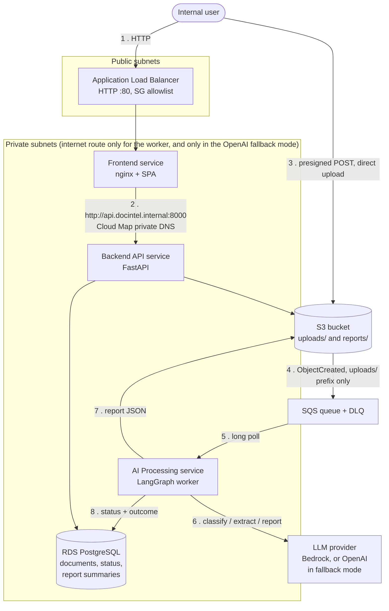
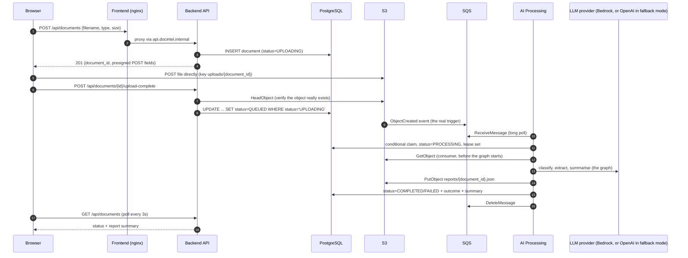
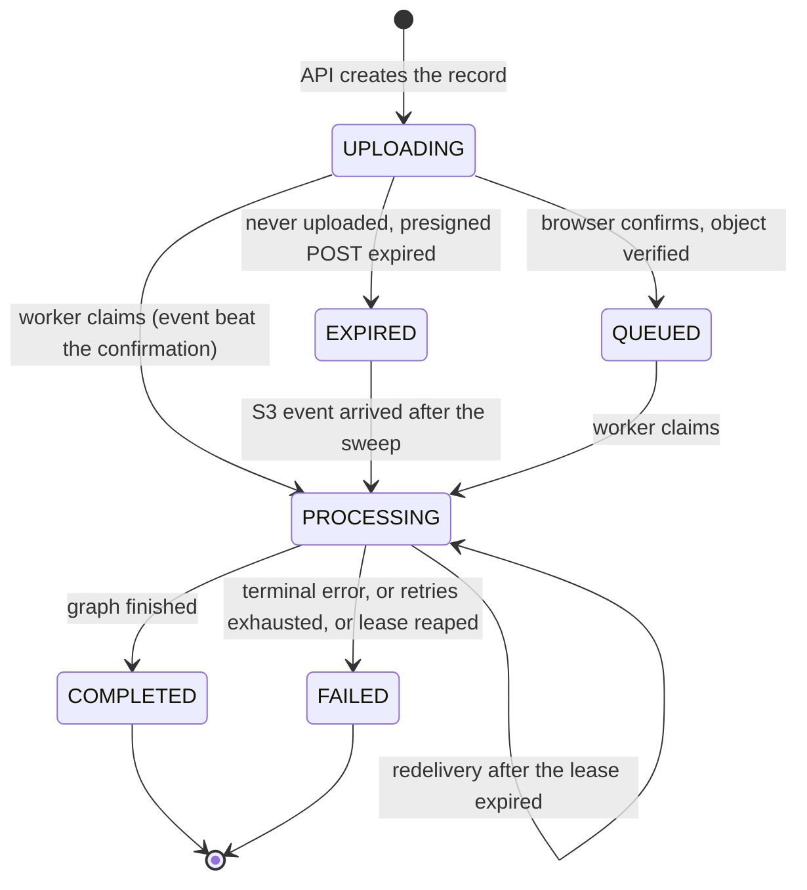
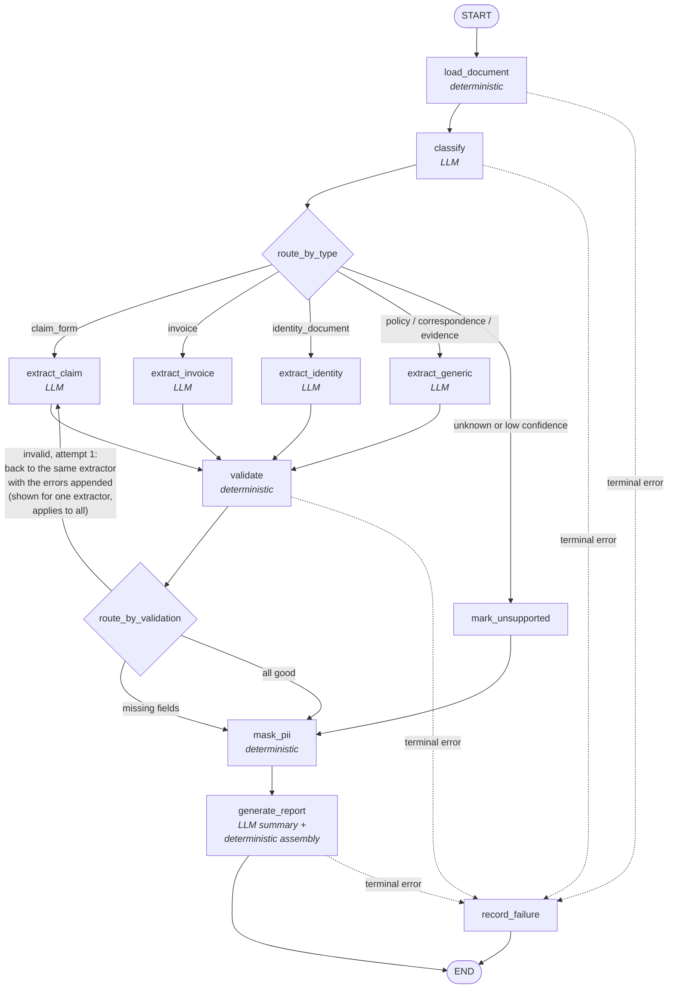
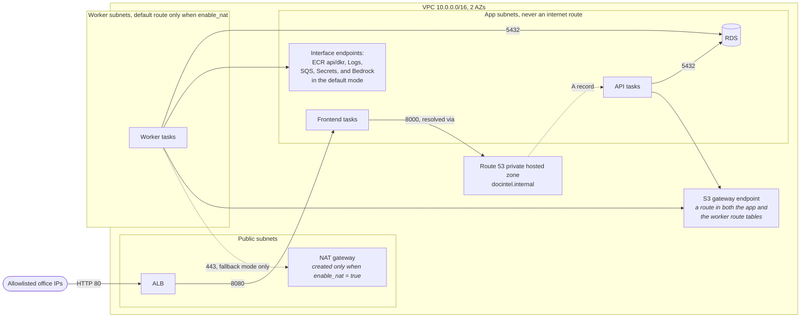
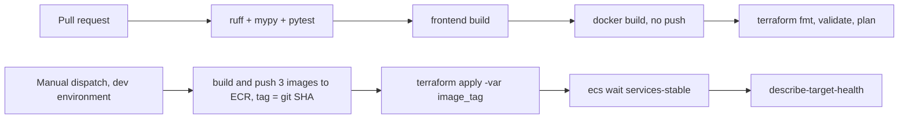

# Architecture

AI Document Intelligence Platform. Business users upload documents, the platform classifies
them, extracts structured information, validates it, and produces a report. Processing is
asynchronous and event-driven, orchestrated with LangGraph, running on AWS ECS, provisioned
with Terraform.

- [1. The whole system on one screen](#1-the-whole-system-on-one-screen)
- [2. End-to-end sequence](#2-end-to-end-sequence)
- [3. Status model](#3-status-model)
- [4. LangGraph workflow](#4-langgraph-workflow)
- [5. Classification and extraction](#5-classification-and-extraction)
- [6. AWS services and why](#6-aws-services-and-why)
- [7. Event-driven design](#7-event-driven-design)
- [8. Networking and private DNS](#8-networking-and-private-dns)
- [9. Terraform structure](#9-terraform-structure)
- [10. ECS and Docker](#10-ecs-and-docker)
- [11. Frontend status updates](#11-frontend-status-updates)
- [12. CI/CD](#12-cicd)
- [13. Assumptions](#13-assumptions)
- [14. Architecture trade-offs](#14-architecture-trade-offs)
- [15. Simplifications and limitations](#15-simplifications-and-limitations)
- [16. Future work](#16-future-work)

---

## 1. The whole system on one screen

Three services, deployed independently on ECS Fargate.

| Service | Runtime | Reachable from | Job |
|---|---|---|---|
| **Frontend** | nginx + React (Vite) | ALB (public listener, IP allowlist) | Serves the SPA, proxies `/api` to the Backend API |
| **Backend API** | FastAPI (Python 3.12) | Frontend only, over private DNS | Intake coordination, metadata, status, history, reports |
| **AI Processing** | Python + LangGraph | Nothing. No inbound listener | Consumes SQS, runs the graph, records the outcome |



**The three rules that shape everything else:**

1. The user's upload connection ends as soon as the file is in S3. Nothing downstream is on
   that connection.
2. The AI Processing service has no inbound listener at all. It cannot be reached, by a user
   or by another service, which is the strongest available answer to "must not be publicly
   accessible."
3. There is no synchronous call between the Backend API and the AI Processing service in
   either direction. They communicate only through S3, SQS and PostgreSQL, all reached
   privately. See [section 8](#8-networking-and-private-dns).

The LLM provider is a variable, not a fixed part of the design. The target is Bedrock with
Amazon Nova Pro, reached through a VPC endpoint with no internet egress. OpenAI is a documented
fallback for when Bedrock is unavailable to the account, and it is the only configuration in
which any task has an internet route. See [section 6](#6-aws-services-and-why) and
[section 8](#8-networking-and-private-dns).

---

## 2. End-to-end sequence



**Why the S3 event is the trigger, and not an API call to SQS.** If the API wrote to S3 and
then sent an SQS message, those are two writes with a crash window between them: the file
exists and nothing processes it. Letting S3 emit the event makes durable storage and the
processing request the same fact. It is also the assignment's own wording: "successful storage
creates a processing request."

**Why `upload-complete` exists, and why it cannot corrupt anything.** The browser knows the
upload finished before the S3 event arrives, so it tells the API and the UI moves to `QUEUED`
immediately. Two guards make this safe:

- The update is conditional on `status='UPLOADING'`, so it can never move a document that the
  worker already claimed backwards from `PROCESSING` to `QUEUED`.
- The API calls `HeadObject` first, so a client cannot mark a document as uploaded without
  actually uploading it.

If the call never happens, processing still runs, because the trigger is the S3 event, not
this endpoint.

**Object key.** The key is `uploads/{document_id}` with no filename in it. S3 URL-encodes keys
in event notifications, so a filename containing a space would arrive as `+` and a naive
consumer would look for the wrong object. The original filename is a column in the database,
and the presigned POST sets `Content-Disposition` so downloads keep it.

---

## 3. Status model

Processing status answers "where is it", and outcome answers "how did it go". Keeping them
separate stops "completed but information is missing" from being modelled as a failure.



| Outcome (on `COMPLETED`) | Meaning |
|---|---|
| `COMPLETE` | Classified, extracted, every required field present and valid |
| `INCOMPLETE` | Extracted, but required fields are missing or failed validation. The report lists them |
| `UNSUPPORTED` | The document type is out of scope or classification confidence was too low. Routed for manual review |

`FAILED` is reserved for technical failure: unreadable file, encrypted PDF, model errors that
survived retries.

### The `documents` table

One table, owned by the Backend API through Alembic. Nothing else defines it: the worker's
claim and reaper tests run this same migration against PostgreSQL in Docker, so there is no
second copy of the DDL anywhere in the repository.

| Column | Type | Note |
|---|---|---|
| `id` | `uuid` primary key | also the S3 key suffix and the correlation id in every log line |
| `filename` | `text` | kept here rather than in the S3 key, see [section 2](#2-end-to-end-sequence) |
| `content_type` | `text` | |
| `size_bytes` | `bigint` | |
| `status` | `text`, CHECK constrained | the six states above |
| `outcome` | `text` null, CHECK constrained | `COMPLETE`, `INCOMPLETE`, `UNSUPPORTED` |
| `doc_type` | `text` null | |
| `current_step` | `text` null | the graph node currently running |
| `lease_expires_at` | `timestamptz` null | the claim and both reaper sweeps key off this |
| `report_summary` | `jsonb` null | summary only; the full report is `reports/{document_id}.json` in S3 |
| `error_message` | `text` null | |
| `attempt_count` | `int` not null default 0 | |
| `created_at`, `updated_at`, `uploaded_at`, `completed_at` | `timestamptz` | |

Indexes: `(status, lease_expires_at)` serves the claim and the reaper,
`(created_at desc)` serves the history list.

`status` and `outcome` are CHECK constrained rather than free text because both drive routing
in the worker and rendering in the frontend. An unexpected value should fail at the write,
not become a row that quietly breaks a screen later.

`EXPIRED` covers rows where the user requested an upload slot and never used it, swept by the
reaper described in [section 7](#7-event-driven-design). **`EXPIRED` is not terminal.** An S3
event is proof that the object exists, so a document swept while its message was sitting in a
backed-up queue is claimable again and processes normally. Only `COMPLETED` and `FAILED` end a
document's life.

---

## 4. LangGraph workflow



The dotted edges apply to every node: any terminal error routes to `record_failure`. Transient
errors are not drawn, because they are not the graph's job. They propagate out of the graph so
SQS redelivers the message, as described in [section 7](#7-event-driven-design).

**Two real routers, and one cycle.** `route_by_type` sends different document types down
different extraction paths. `route_by_validation` can send the state back **to the same
extraction node** for one more attempt with the validation errors appended to the prompt. That
is the assignment's "selecting an appropriate next processing step", and routing back to the
extractor rather than to a separate retry node means the retry follows the identical path,
including any type-specific handling.

**Why masking sits after validation and before the report.** Validation checks ID number
formats and cross-field rules, which must run against real values. The report and its summary
must never contain them. `mask_pii` therefore runs once, after the last validation pass, and
the summary prompt is built from the masked state.

**What `mask_pii` masks.** Each per-type Pydantic schema tags sensitive fields with
`pii=True`: identity numbers, dates of birth, full addresses, bank and card numbers, contact
details. The node masks the value of every field tagged that way, plus the evidence snippet
attached to any such field, plus any occurrence of those values in the `trace`. Masking keeps
a recognisable shape, for example `••••••-••-4321`, so a reviewer can still tell one document
from another. Raw `text`, `page_images` and unmasked field values are never written to logs or
persisted in the report.

### State model

One `TypedDict` shared by every node. Nodes return only the keys they change.

| Key | Type | Written by |
|---|---|---|
| `document_id`, `s3_key`, `content_type`, `file_size`, `filename` | identifiers | the consumer, from the SQS message |
| `raw_bytes` | the original file | the consumer, fetched from S3 before the graph starts |
| `text`, `page_images` | extracted content | `load_document` |
| `doc_type`, `confidence`, `classification_notes` | classification | `classify` |
| `extracted` | `dict` validated against a per-type Pydantic model | extraction nodes |
| `extraction_attempts` | `int` | extraction nodes |
| `missing_fields`, `validation_errors` | `list[str]` | `validate` |
| `outcome` | enum | routers and `mark_unsupported` |
| `report` | `dict` | `generate_report` |
| `error` | `{node, kind, message}` or `None` | any node |
| `trace` | `Annotated[list[StepRecord], operator.add]` | every node, appended |
| `masked_trace` | `list[StepRecord]` | `mask_pii`, written once. The copy the report carries |
| `observations` | `Annotated[list[str], operator.add]` | any node, appended. Notes for the report: a page cap hit, a retry, verification skipped |

`trace` is the only accumulating key, so it uses a reducer. Everything else is last-write-wins,
which is what we want when a retry overwrites an earlier extraction.

`StepRecord` is `{node: str, status: "ok" | "error", duration_ms: int, detail: str | None}`.

**Masking writes `masked_trace`, not `trace`.** `trace` accumulates through a reducer, so a
node that returns it appends to it and can never replace it. `mask_pii` therefore writes the
scrubbed copy to a separate `masked_trace` key, and `generate_report` persists that one.
Raw `trace` exists only for the duration of the run: it is never written to a log, never
persisted, and there is no checkpointer to store it, so the guarantee that nothing sensitive
leaves the worker is unchanged. The mechanism differs from "the node masks the trace" only
because an append only key cannot be masked in place.

**The graph makes no AWS call at all, not only no database call.** The consumer fetches the
object from S3 and puts the bytes into the initial state as `raw_bytes`; `load_document` is
pure parsing. Fetching is infrastructure work, which belongs to the `consumer/` layer in the
table above, and moving it there is what lets the entire graph run in tests and in a local
script against a file on disk, with no credentials and nothing mocked.

### The report

`generate_report` assembles this deterministically around one LLM written summary, and writes
it to `reports/{document_id}.json`. The `summary` and `report_summary` fields are the only
parts the model writes; everything else is carried through from state.

```json
{
  "document_id": "...",
  "generated_at": "...",
  "document_type": "claim_form",
  "classification": { "confidence": 0.93, "notes": "..." },
  "outcome": "INCOMPLETE",
  "summary": "one paragraph, written by the model from the masked state",
  "extracted": { "field_name": { "value": "...", "snippet": "...", "verified": true } },
  "missing_information": ["..."],
  "validation_errors": ["..."],
  "observations": ["..."],
  "trace": [{ "node": "...", "status": "ok", "duration_ms": 12, "detail": null }]
}
```

Every extracted field carries the evidence snippet it came from and whether that snippet was
verified against the source text. That is what makes the deterministic hallucination check in
[section 5](#5-classification-and-extraction) visible in the output rather than only in logs.

The classification confidence threshold below which a document routes to `UNSUPPORTED` is
`CLASSIFY_CONFIDENCE_THRESHOLD`, default `0.60`. The retry budget for the validation cycle is
`MAX_EXTRACTION_ATTEMPTS`, default `2`, so exactly one retry before the graph proceeds with
whatever it has and the outcome becomes `INCOMPLETE`.

### Workflow status tracking

The consumer runs the graph with `graph.stream()` and writes the node name to a `current_step`
column as each node completes. The graph itself performs no database calls, which keeps it
runnable in tests with no AWS and no database.

### The four layers, kept separate

The assignment asks us to distinguish these. They map to directories in the worker:

| Layer | Where | Example |
|---|---|---|
| Infrastructure event handling | `consumer/` | SQS long poll, claim, lease and visibility heartbeat, ack rules, DLQ behaviour, reaper |
| LangGraph orchestration | `graph/` | Node wiring, routers, state |
| Deterministic application logic | `rules/` | File parsing, required-field checks, invoice arithmetic, date ordering, snippet verification, PII masking |
| LLM-assisted processing | `llm/` | Provider selection via `init_chat_model`, prompts, structured output schemas |

The graph never calls the LLM provider or SQS directly. That boundary is what makes the graph
testable with a fake LLM and no AWS.

---

## 5. Classification and extraction

**Reading the file (deterministic).** PDF text via `pypdf`, DOCX via `python-docx`. If a PDF
yields almost no text it is treated as scanned, and pages are rendered to images with
`pypdfium2`. PyMuPDF is deliberately avoided: it is AGPL licensed, which is a problem for
internal commercial software.

Model input limits are enforced before the call, not discovered during it: images are
downscaled to stay under the model's per-image size limit, and scanned documents are capped at
the first 20 pages to stay within model input limits. Anything longer is processed on its text
where possible and flagged in the report's observations.

**Classification (LLM).** One model call returning a structured object: `doc_type` from a
fixed enum, `confidence` 0 to 1, and a short rationale. Below a configurable confidence
threshold the document is routed to `UNSUPPORTED` rather than guessed at, so a wrong type never
silently produces a confident but wrong extraction.

**Extraction (LLM, per type).** Each document type has a Pydantic model describing its fields
and which are required. The model is given the schema and returns structured output, so parsing
failures surface as validation errors instead of malformed text. Every field carries the
**evidence snippet** it came from.

**Validation (deterministic, not the LLM).**

- Required-field presence per document type.
- Date parsing and ordering, for example an incident date cannot be after the claim date.
- Currency amounts, and invoice line items summing to the stated total.
- ID and policy number formats.
- **Snippet verification**: every evidence snippet must actually appear in the source text.
  A snippet that does not is a hallucinated citation, and the field is rejected. This is a
  deterministic hallucination check, and it is why the fields carry snippets at all.
  Matching normalises whitespace and case, so a line break or a capitalisation difference
  inside a genuine quote is not mistaken for a hallucination. The check is **skipped for
  image-only input** (scanned PDFs and images), where there is no extracted text to match
  against, and the report's observations record that extraction was not snippet-verified.

Deliberately not an LLM call: these are rules with exact answers, and a model would make them
non-deterministic and slower for no gain.

**On model self-reported confidence.** The classifier's confidence is used only as a routing
threshold, and per-field confidence scores are not used as a quality signal, because they are
not calibrated and cannot be defended as probabilities. Snippet verification is the check that
actually catches bad extraction.

---

## 6. AWS services and why

| Need | Service | Why this one | Rejected |
|---|---|---|---|
| Document and report storage | **S3** | Durable, versioned, presigned uploads keep bytes out of the API | EFS (needs mounting, no event story) |
| Processing requests | **SQS standard + DLQ** | At-least-once delivery, visibility timeout gives retry and delay, DLQ captures poison messages | EventBridge (one producer, one consumer, adds a hop); SNS (no retention) |
| Status, history, metadata | **RDS PostgreSQL** | Relational queries for history and filtering, and the claim is a single conditional statement | DynamoDB (workable, but the claim and list queries are more natural in SQL) |
| LLM | **Bedrock** (default), OpenAI as a switchable fallback | In the default mode: IAM authentication, no API key to store, and traffic reaches it through a VPC endpoint. The fallback trades all three away, see below | A hosted model API as the only provider (no way back to keyless, in-network inference) |
| Compute | **ECS Fargate** | Required by the assignment. No servers to patch, per-service scaling | EC2 launch type (capacity management for no benefit here) |
| Private DNS | **Cloud Map service discovery** | Real Route 53 private hosted zone records, no sidecar | ECS Service Connect (see [trade-offs](#14-architecture-trade-offs)) |
| Images | **ECR** | Private registry, immutable tags, lifecycle policy | Docker Hub (public, rate limited) |
| Logs | **CloudWatch Logs** | Native ECS integration, one log group per service | |
| Secrets | **Secrets Manager** | RDS generates and rotates the password; it never appears in Terraform state or code | Plaintext env vars |

**Model choice and data residency.** The default is `apac.amazon.nova-pro-v1:0`. The reasons,
in the order they mattered:

1. **APAC-scoped inference profile**, so the residency argument in
   [assumption 6](#13-assumptions) holds. Requests stay inside the APAC regions the profile
   routes to.
2. **Accepts images**, which the scanned-PDF path in [section 5](#5-classification-and-extraction)
   depends on.
3. **Not a legacy model**, so there is no announced end of life to design around.
4. **No provider use case form**, unlike third-party models on Bedrock.
5. **Roughly four times cheaper** than Claude Sonnet 4 per token, which matters for a workload
   that sends whole documents.

Neither the provider nor the model is hardcoded. Two Terraform variables reach the worker as
environment variables: `llm_provider`, which is `bedrock` by default and `openai` as the
fallback, and `llm_model_id`, which names the model within that provider. The `llm/` layer
builds the chat model with LangChain's `init_chat_model`, selecting the provider from
`llm_provider`. The graph, the prompts and the structured output schemas are identical across
providers, so switching is a variable change and a deploy with no code change. See
[section 9](#9-terraform-structure).

### The OpenAI fallback

Invoking Bedrock requires the account to hold a token quota for the model. An account with
little usage history can hold a daily quota of zero, and the daily quota is not self-service
adjustable, so raising it means an AWS Support case rather than a console setting. When that
blocks Bedrock entirely, the platform can run on OpenAI instead.

| Aspect | `llm_provider = "bedrock"` (default) | `llm_provider = "openai"` (fallback) |
|---|---|---|
| Model | `apac.amazon.nova-pro-v1:0` | A small multimodal OpenAI model, set in `llm_model_id` |
| Authentication | IAM role, no credential stored | API key in Secrets Manager |
| Network path | Bedrock VPC endpoint, no internet route | Outbound 443 through a NAT gateway |
| Residency | APAC regions the inference profile routes to | No residency guarantee |
| Documents | Stay inside AWS | Leave AWS |

**The API key never touches the repository, the image, the task definition or Terraform
state.** The `bootstrap/` stack creates an empty Secrets Manager secret, and the value is set
out of band with a single CLI command documented in the README. The secret lives in bootstrap
for the same reason ECR does: if the main stack created it alongside the worker service, the
worker would start with no key, crash, trip the deployment circuit breaker and fail the apply.
The order is bootstrap, set the key, push images, apply. The worker reads it with boto3 at startup,
the same pattern [section 10](#10-ecs-and-docker) already uses for the database password.

The fallback also requires network egress, which is off by default. See
[section 8](#8-networking-and-private-dns).

**The documented alternative** is `apac.anthropic.claude-sonnet-4-20250514-v1:0`, the newest
Claude available through an APAC-scoped profile in this region. It carries two prerequisites
the default does not: AWS marks the underlying model LEGACY with end of life on **2026-10-14**,
and the account must submit the Anthropic use case details once in the console before any
Claude model can be invoked.

**IAM for cross-region inference.** Invoking through an inference profile requires permission
on the profile *and* on the underlying foundation model in every region that profile routes to.
The worker's policy grants `bedrock:InvokeModel` on the inference profile ARN plus the
foundation model ARN in each of those regions. The region list differs per profile, so
Terraform reads it from the `aws_bedrock_inference_profile` data source (its `models` list
carries one `model_arn` per region) for whichever profile `llm_model_id` names, rather than
carrying a hardcoded list that goes stale when the model changes. This applies in the default mode only. The two modes are mutually exclusive in IAM: in the
default mode the worker has the Bedrock permissions above and no access to the OpenAI secret,
and in the fallback mode it has `secretsmanager:GetSecretValue` on that one secret and no
Bedrock permissions at all.

---

## 7. Event-driven design

| Concern | How it is handled |
|---|---|
| **Reliable delivery** | S3 to SQS is an AWS-managed notification with its own retries. The event is filtered to the `uploads/` prefix, so the worker never triggers on its own report writes into the same bucket. The consumer ignores the `s3:TestEvent` message that S3 sends when the notification is created |
| **Duplicate requests** | SQS is at-least-once. The worker claims with `UPDATE ... WHERE id = $1 AND (status IN ('UPLOADING','QUEUED','EXPIRED') OR (status='PROCESSING' AND lease_expires_at < now()))`. The `PROCESSING` clause is scoped so an expired lease is reclaimable while `COMPLETED` and `FAILED` rows, whose leases are also long expired, are never reprocessed. `EXPIRED` is claimable because the S3 event proves the object exists, whatever the reaper concluded earlier |
| **A claim that returns no row** | Someone else owns it, or it is finished. Terminal means `COMPLETED` or `FAILED` only. The message is acked **only if the row is already terminal**. Otherwise it is left to time out and return, because acking it would delete the only copy of the work if the current owner is dead |
| **Who owns the document, not just whether it is owned** | `attempt_count` is a fencing token. The claim increments it and returns it, and the heartbeat and both finishing writes carry it in their `WHERE`. Checking only for `PROCESSING` with a live lease is not enough: a worker whose lease lapsed, whose document was reclaimed, and which then woke and beat, would push the lease out again and pass that check while someone else owned the row. A reclaim bumps the count, which invalidates the previous holder's token permanently |
| **The order of the two writes on success** | The conditional database write settles ownership, so it goes first and the report is published to S3 only if it succeeds. Publishing first let a worker that had already lost the lease overwrite the winner's report and only then discover its own write was refused, leaving a row describing one run beside a stored report from another |
| **The two writes are one step** | The status write is held open, uncommitted, until the report is stored, and the row lock it takes is what stops anyone else claiming the document in that window. A failed put rolls the status back, so the document stays `PROCESSING` and the message is returned for SQS to redeliver. Committing the status first was not recoverable: the redelivery found the document terminal and deleted the message without retrying, so the report route stayed 404 for the life of the document |
| **Delayed processing** | Work sits in the queue when the worker is busy or scaled down. The queue is the buffer, so intake never blocks |
| **Long-running work** | One heartbeat extends both the SQS visibility timeout and the database lease, so the two never disagree about who owns the document. The lease is extended first, so that the few milliseconds of skew between the two calls fall on the visibility timeout: a returned message must not become visible before its own lease has died, or the redelivery refuses its own claim and burns an attempt |
| **Transient failure** | Throttling and timeouts are retried in the LLM client, then the exception propagates so SQS redelivers. The document is *not* marked failed, because it is not finished |
| **Terminal failure** | Unreadable or unsupported files, or the final delivery attempt (`ApproximateReceiveCount` equals the redrive limit), record `FAILED` with a reason and ack. Only the worker holding the claim may write `FAILED` |
| **Poison messages** | After the redrive limit the message lands in the DLQ. A CloudWatch alarm on DLQ depth surfaces it |
| **Stuck rows** | A worker that dies on every attempt sends the message to the DLQ without anyone writing a status. A reaper statement in the poll loop sweeps rows left in `PROCESSING` with a lease expired well past the redrive window, and rows left in `UPLOADING` past the presigned POST expiry. The second sweep is a guess about a user who walked away, so it writes `EXPIRED`, which a later S3 event can still override |
| **Recovery after interruption** | If a worker dies mid-graph, the message reappears after the visibility timeout, the lease has expired, and the graph re-runs from the start. Re-running a handful of model calls is cheaper than operating a checkpoint store |
| **Traceability** | `document_id` is the correlation id in every log line across all three services, and it is the S3 key. S3 event notifications cannot carry custom message attributes, so the consumer parses the id from the key and puts it into the logging context for the whole message lifetime. The per-node `trace` is persisted with the report |
| **Independent scaling** | The API scales on average CPU with target tracking. Request count is not available to it, because request count is a load balancer metric and the API deliberately has no target group. The worker uses step scaling on `ApproximateNumberOfMessagesVisible`, so a burst of uploads adds workers and never slows intake |

---

## 8. Networking and private DNS



**Topology.** Public subnets hold only the load balancer, plus the NAT gateway when
`enable_nat` is true. All three services and the database
run in private subnets. Everything the tasks need (ECR, CloudWatch Logs, SQS, Bedrock, Secrets
Manager, S3) is reached through VPC endpoints, so traffic to AWS APIs never leaves the AWS
network in either mode. The S3 gateway endpoint is a route table entry rather than something
inside a subnet, and it is associated with both the app and the worker route tables, so the
worker's separate routing does not cost it private access to S3.

**Egress is a variable, and it is scoped to one service.** `enable_nat` defaults to false, and
in that mode no subnet has a route to the internet. When it is true, Terraform creates one NAT
gateway in a public subnet, which is the only place a NAT gateway can work because it needs the
internet gateway route, and adds a default route pointing at it to the **worker's** route table
only. That is why the worker
sits in its own pair of private subnets with its own route table: the frontend, the API and the
database can then never acquire an internet route, whatever the variable says.

`enable_nat` exists for the OpenAI fallback and nothing else. A plan with
`llm_provider = "openai"` and `enable_nat = false` fails a variable validation at plan time
rather than deploying a worker that cannot reach its model. The AWS endpoints (ECR, Logs, SQS,
Secrets Manager, S3) stay in place in both modes: AWS API traffic keeps using them, and only
calls to the OpenAI API traverse the NAT gateway. The one exception is the Bedrock endpoint,
which is created only when `llm_provider = "bedrock"`. Nothing calls Bedrock in the fallback
mode, and an idle interface endpoint still bills by the hour.

**Private service discovery.** Terraform creates a Cloud Map **private DNS namespace**,
`docintel.internal`. Cloud Map itself creates and owns the Route 53 private hosted zone behind
that namespace and associates it with the VPC, so no hosted zone resource appears in our
configuration. ECS then registers and deregisters each API task's IP as tasks start and stop.
The name resolves only inside the VPC, and `dig api.docintel.internal` from a task returns the
current task IPs.

Only the API is registered. The frontend is reached through the load balancer and the worker
has no callers, so neither needs a name.

**Record TTL and nginx.** The A records use a 10 second TTL. nginx caches DNS answers for the
lifetime of the process by default, which would pin it to a task that no longer exists, so the
config sets `resolver ${DNS_RESOLVER} valid=10s` and uses a variable in `proxy_pass`, which
forces re-resolution on that same 10 second cycle.

The resolver address is an environment variable rather than a literal because it differs by
environment: it is `169.254.169.253`, the VPC DNS address, on AWS, and `127.0.0.11`, Docker's
embedded DNS, under the local compose stack. Hardcoding either would break the other. The
nginx image's own template mechanism handles the substitution: the config ships as
`/etc/nginx/templates/default.conf.template` and the image entrypoint runs `envsubst` over it
at container start, so no custom entrypoint script is needed. `nginx-unprivileged` carries the
same entrypoint scripts as the official image.

Ten seconds of staleness is still real: during a rolling deploy nginx can hand a request to a
task that is draining. `proxy_next_upstream` covers that window by retrying the request
against the next address from the refreshed record, which is the retry behaviour we would
otherwise have got from a sidecar proxy.

**Frontend to backend.** The browser only ever talks to one origin: the load balancer. nginx
forwards `/api` over the internal domain name. Consequences worth stating:

- The Backend API has no target group and no public path. It is unreachable from the internet.
- Same origin, so no CORS on the API and no per-environment API URL baked into the SPA build.

**The S3 bucket does need CORS**, because the browser posts the file directly to it. The rule
allows `POST` from the load balancer's origin only.

**Backend API to the AI Processing service.** There is no synchronous path, by design. They
communicate only through shared infrastructure, all of it private:

| Direction | Medium | Path |
|---|---|---|
| Intake to processing | SQS message, emitted by S3 | S3 and SQS VPC endpoints |
| Processing to API | Status, outcome and summary rows in PostgreSQL | Private subnet, security group restricted |
| Report contents | `reports/{document_id}.json` in S3, read by the API when a user opens a report | S3 gateway endpoint |

This is what keeps the two services independently deployable and independently scalable: the
API does not fail when the worker is down, and the worker does not fail when the API is down.

**Security groups, each allowing exactly one source:**

| Group | Inbound |
|---|---|
| `alb` | 80 from the allowlisted CIDRs |
| `frontend` | 8080 from `alb` |
| `api` | 8000 from `frontend` |
| `worker` | nothing. Egress is restricted to 443 (VPC endpoints, and the OpenAI API in fallback mode) and 5432 to the `rds` group |
| `rds` | 5432 from `api` and `worker` |
| `endpoints` | 443 from the three task groups |

**Egress summary.** In the default mode no task has an internet route at all. In the fallback
mode only the worker does, and its security group limits internet-bound traffic to port 443.
Its only other egress rule is 5432 to the database. Independent of either,
the browser uploads to S3 over the public S3 endpoint using a presigned POST, scoped to one
key, one content type, a size limit, and a five minute expiry.

---

## 9. Terraform structure

```
infra/
  bootstrap/          # state bucket, ECR repositories, GitHub OIDC role,
                      # empty OpenAI key secret. Local state, run once
  modules/
    ecs_service/      # task definition, service, log group, autoscaling,
                      # optional Cloud Map registration (the API only)
  network.tf          # VPC, app and worker subnets with separate route tables,
                      # optional NAT gateway (worker route table only),
                      # VPC endpoints, Cloud Map private DNS namespace
  security_groups.tf  # six groups. Every rule is its own resource and names one source
  data.tf             # S3, RDS, SQS + DLQ
  ecs.tf              # cluster, three ecs_service module calls, worker step scaling
  alb.tf              # load balancer, listener, target group
  iam.tf              # task roles, least privilege per service. The worker gets Bedrock
                      # permissions or the OpenAI secret, never both
  versions.tf variables.tf outputs.tf
  envs/
    dev.tfvars  dev.backend.hcl
    dev.local.tfvars.example   # allowed_cidrs. The real file is gitignored
    prod.tfvars.example
```

| Requirement | How |
|---|---|
| Reusable components | One module, `ecs_service`, used three times. Nothing else is repeated, so nothing else is a module |
| Environment configuration | One root, per-environment `.tfvars` and backend files. No workspaces, no copied directories |
| State | S3 backend with versioning, encryption and native S3 locking (`use_lockfile`). The DynamoDB lock table is deprecated |
| Bootstrap | The state bucket cannot live in the stack it backs. **ECR lives here too**: the ECS services need an image to exist before their first deployment, so the repositories are created and the first images pushed before the main stack is ever applied. Otherwise the first `terraform apply` starts services with no image, the deployment circuit breaker trips, and the apply fails. The empty OpenAI key secret lives here for the same reason: the key must be set before the worker first starts in fallback mode |
| Configurable variables | Environment-shaped inputs are variables, not constants: `allowed_cidrs`, task sizes and desired counts, the database instance class, log retention, `llm_provider` and `llm_model_id`, both passed to the worker as environment variables, and `enable_nat`. Changing model or provider is a variable change rather than a code change |
| Meaningful outputs | ALB URL, ECR repository URLs, queue URLs, bucket name, RDS endpoint |
| Safety | The provider pins `allowed_account_ids`, so an apply against the wrong AWS account fails immediately. A second guard covers the LLM fallback: `llm_provider = "openai"` with `enable_nat = false` fails the plan, because that combination deploys a worker with no route to its model. The failure happens at plan time, not at runtime |

**Infrastructure and application concerns.** Terraform owns infrastructure and the task
definitions, and takes the image tag as a variable. Deploying the application is
`terraform apply -var="image_tag=<git sha>"`. One mechanism, one source of truth, and the
running image is visible in state. The trade-off is in [section 14](#14-architecture-trade-offs).

---

## 10. ECS and Docker

| Decision | Choice and reason |
|---|---|
| Launch type | Fargate. No node pool to run for three small services |
| Task sizing | Frontend and API 0.25 vCPU / 0.5 GB. Worker 0.5 vCPU / 1 GB, because PDF rendering and model calls dominate |
| Images | Multi-stage builds, non-root user, `python:3.12-slim` and `nginx-unprivileged` bases, dependencies installed in a cached layer before app code. Python dependencies are installed from a committed `uv.lock` with `uv sync --frozen` in the builder stage, and the frontend from `package-lock.json` with `npm ci`, so two builds of one commit ship identical library versions. `uv` never reaches the runtime image |
| Ports | The frontend listens on **8080**, because `nginx-unprivileged` cannot bind 80 as a non-root user. The ALB target group points at 8080 |
| Tags | Immutable, tagged with the git SHA. `latest` is never deployed |
| Configuration | Environment variables per environment from the task definition |
| Database credentials | **Not** injected as an ECS `secrets` reference. RDS rotates the managed master password roughly every 7 days, and ECS resolves `secrets` only at task start, so a long-running task would keep a stale password and lose the database. The applications read the secret from Secrets Manager with boto3 when they open a connection pool, cache it, and refetch once on an authentication error |
| OpenAI API key (fallback mode) | Same pattern: read from Secrets Manager with boto3 at worker startup. The `bootstrap/` stack creates the secret empty and the value is set out of band with one documented CLI command before the main stack is applied, so the key is absent from the repository, the image, the task definition and Terraform state. In the default Bedrock mode the worker needs no model credential at all |
| Schema migrations | The API runs Alembic at startup, holding a PostgreSQL advisory lock so concurrent tasks cannot race. CI cannot run migrations, because the database is private and has no public path |
| Health checks | Frontend: ALB target group on `/healthz`. API: container command against `/healthz`, since it has no target group. Worker: container command checking that the poll loop has written a recent heartbeat |
| Logging | `awslogs` driver, one log group per service, JSON lines with `document_id` |
| Scaling | Independent per service. API on CPU, frontend fixed at the environment's desired count. The worker uses step scaling on the queue's `ApproximateNumberOfMessagesVisible`: add a task when the backlog passes a threshold, remove one when the queue is empty. Step scaling rather than target tracking, because raw queue depth is not proportional to capacity, which target tracking assumes. The minimum is 1 task in dev, so the reaper always has a poll loop to run in |
| Deployment | Rolling, with the deployment circuit breaker and automatic rollback enabled |
| Shutdown | The worker traps SIGTERM, stops polling, finishes the message in flight, and has a 120 second stop timeout |

---

## 11. Frontend status updates

**Mechanism: polling.** `GET /api/documents` every 3 seconds while any document is in a
non-terminal state, backing off to 15 seconds when nothing is in flight, and refetching on
window focus. A toast fires on a transition into `COMPLETED` or `FAILED`.

**`EXPIRED` counts as settled for polling.** It is recoverable in the backend, since a late S3
event can still claim the row, but an abandoned upload would otherwise keep the 3 second poll
running forever. The frontend therefore stops fast polling once every document is
`COMPLETED`, `FAILED` or `EXPIRED`, and the slow 15 second poll picks up the rare case where
an `EXPIRED` document starts processing after all.

| Question the assignment asks | Answer |
|---|---|
| How do updates reach the frontend? | The client asks. The database is the single source of truth, and the worker writes to it |
| How is state recovered after a reconnect? | The next poll returns the full current state. There is no missed-event problem, because there are no events to miss |
| How are temporary connection failures handled? | A failed poll is retried on the next tick. Nothing is lost |
| Why this approach? | No sticky sessions on the load balancer, no connection state to survive task replacement, and no pub/sub fan-out between API tasks. The failure mode is a delayed update, not a wrong one |
| How does it handle many users and documents? | Each poll is one indexed query. At internal scale (tens of users, hundreds of documents) this is negligible |

**When this stops being the right answer.** At thousands of concurrent viewers the polling load
becomes real. The upgrade path is server-sent events from the API, with PostgreSQL
`LISTEN/NOTIFY` fanning a worker's update out to whichever API task holds each connection, and
polling kept as the reconnect path.

---

## 12. CI/CD

GitHub Actions, authenticating to AWS with OIDC and a short-lived role. No AWS keys are stored
in the repository.



**The deploy workflow never applies on its own.** Two independent gates stand between a
merge and a change to AWS:

1. It has no `push` trigger at all. The only way to start it is `workflow_dispatch`, a person
   pressing a button. Merging to `main` starts nothing, so merging documentation cannot apply
   Terraform, and after a `terraform destroy` nothing recreates the stack.
2. Every job that touches AWS runs in the `dev` GitHub environment, which is restricted to
   the `main` branch. The deploy role's trust policy accepts only that environment's OIDC
   subject (`repo:<owner>/<repo>:environment:dev`), so no other workflow, branch or event in
   the repository can assume it, whatever its YAML says. A pull request can assume only the
   read only plan role, whose trust policy accepts only the `pull_request` subject.

A required reviewer on the environment would be a third gate. GitHub offers that rule for
private repositories only on paid plans, and the API refused it here, so it is listed under
[simplifications](#15-simplifications-and-limitations) rather than claimed.

The reason is that this repository deploys into a single real AWS account with a real
database. An automatic apply on merge is the right default for a service with separate
environments and a promotion path; with one environment it means any merge can change the
running system with no human in the loop. The cost is that a deploy is one extra click.

Both runners are `ubuntu-24.04-arm`. The task definitions declare the `ARM64` runtime
platform, so the images must be arm64, and a native arm64 runner avoids building under QEMU
emulation. arm64 standard runners became available in private repositories, free tier
eligible, in January 2026.

When an environment is deliberately torn down, the workflow is disabled rather than left
dormant (`gh workflow disable deploy.yml`), so a stray dispatch cannot rebuild infrastructure
that was meant to be gone.

| Requirement | Where |
|---|---|
| Application code validation | `ruff`, `mypy`, `pytest` on every pull request. The tests drive the graph with a fake LLM, so CI never calls a paid API and needs no network access or model credentials, whichever provider is configured |
| Docker image builds | Built on every pull request and never pushed there. Pushed only by the deploy workflow, which is the only place the deploy role can be assumed |
| Container image publishing | ECR, immutable SHA tags, layer cache between runs |
| Terraform formatting and validation | `fmt -check`, `validate` for both stacks, then a `plan` with the read only role, posted on the pull request. The plan uses the image tag that is currently running, so it shows the infrastructure change and not a redeploy |
| Infrastructure deployment | `terraform apply`, on manual dispatch from `main` in the `dev` environment, never automatically on merge |
| Application deployment | The same apply with the new image tag |
| Deployment verification | `aws ecs wait services-stable` for all three services, then `aws elbv2 describe-target-health`. **Not** an HTTP request to the load balancer: GitHub's runners are not in the IP allowlist, so a smoke test from CI would be blocked by design |

The target organisation uses Bitbucket Pipelines. The stages map one to one (`step` per job, OIDC through
Bitbucket's identity provider, `deployments` for environment gating). GitHub Actions is used
here so the pipeline in the submitted repository actually runs.

---

## 13. Assumptions

1. **Internal users, no end-user authentication.** The assignment describes an internal tool.
   Access is restricted at the network edge by an IP allowlist. In production this sits behind
   the corporate identity provider, which is a load balancer OIDC action rather than
   application code.
2. **"The frontend communicates with the Backend API using a domain name"** is read as the
   frontend service calling `api.docintel.internal`, a private name resolved inside the VPC.
   The browser reaches one origin, the load balancer, and never addresses the API directly.
3. **Reviewer access.** Whoever needs to open the application must have their public IP in
   `allowed_cidrs`, or watch a demo from a machine that already is.
4. **Documents are small.** Up to 20 MB and roughly 20 pages, enforced in the presigned POST
   policy and in the page cap before model calls.
5. **English-language documents.**
6. **Data residency is APAC, not Singapore-only, and only in the Bedrock mode.** The platform
   invokes Bedrock through an APAC-scoped inference profile, so a request may be served from
   any APAC region that profile routes to, not only Singapore. For real customer data this
   needs a compliance decision, and it is the reason the profile is APAC-scoped rather than
   global. The OpenAI fallback carries no residency guarantee whatsoever: documents leave AWS
   and are processed by a third party.
7. **Documents sent to OpenAI are synthetic only.** The fallback exists so the platform can be
   demonstrated end to end while the account's Bedrock access is blocked. With real customer
   data it is not an acceptable configuration, and `llm_provider` must be `bedrock`.
8. **Synthetic data only.** Every sample document is generated by a script in `samples/`. No
   real customer data, and the identity samples are fictional.
9. **Reviewers may destroy and recreate the environment.** Everything is reproducible from the
   bootstrap step plus `terraform apply`.

---

## 14. Architecture trade-offs

Decisions where a reasonable engineer would choose differently, and what the alternative costs.

| Decision | What we gain | What we give up | When the alternative wins |
|---|---|---|---|
| **Cloud Map DNS instead of ECS Service Connect** | Real Route 53 records, no Envoy sidecar, no extra CPU per task, nothing depending on the sidecar's management traffic in a VPC whose application subnets have no internet route | Envoy's client-side retries, outlier ejection and per-call metrics. DNS answers can briefly be stale, mitigated by a short TTL and nginx re-resolving every 10 seconds | Meshed service-to-service calls, where retries and circuit breaking matter more than simplicity |
| **Terraform deploys the application** | One mechanism, one source of truth, the running image visible in state | An application deploy runs a full plan and apply, which is slower and needs infrastructure credentials in the deploy job | High deploy frequency, where CI should register a task definition revision and Terraform should ignore image changes |
| **Polling instead of SSE or WebSockets** | Trivial reconnect, no sticky sessions, no fan-out between API tasks | Latency up to one poll interval, and wasted requests when nothing changes | Thousands of concurrent viewers, or sub-second update requirements |
| **VPC endpoints instead of a NAT gateway** | In the default mode, no internet route from any task, so egress is impossible rather than merely unused. That claim holds only while `enable_nat` is false | Roughly $9.50 per endpoint per month, about $57 for six, which is **more** than a NAT gateway. This is a security decision, not a cost saving | Workloads that genuinely need general internet access, for example calling a third-party API |
| **OpenAI over a NAT gateway as the fallback provider** | A working end-to-end demo with real classification and extraction while the account's Bedrock quota is blocked, with no change to the graph, the prompts or the schemas | Outbound internet from the worker, an API key to store and rotate, and documents leaving AWS to a third party | As soon as Bedrock quota is granted. Going back is a two variable change, `llm_provider` and `enable_nat`, with no code change |
| **Re-run the graph instead of checkpointing** | No checkpoint store to operate, and a simpler state model | A crash late in the graph repeats every model call for that document | Long or expensive graphs, where `PostgresSaver` pays for itself |
| **RDS PostgreSQL instead of DynamoDB** | SQL for history and filtering, one conditional statement for the claim, transactions | A managed database in private subnets, a password to rotate, and migrations to run | Purely key-based access at large scale, where DynamoDB removes the database from the network diagram entirely |
| **Presigned upload straight to S3** | The API never handles file bytes, so intake stays small and fast | The browser must reach the public S3 endpoint, and the bucket needs CORS | A fully air-gapped network, where uploads would have to be proxied through the API |
| **Nova Pro instead of Claude** | Roughly four times cheaper per token, routing confined to APAC regions, and no legacy end-of-life deadline or provider use case form to clear | Extraction quality on hard documents is unproven. Claude is the stronger model on messy layouts, and we will not know the size of the gap until the sample set is scored | When evaluation shows a quality gap that matters. Switching is an `llm_model_id` variable change, since both models are reached through the same provider-agnostic chat interface |

---

## 15. Simplifications and limitations

Each row states what was simplified, why, the production approach, and the limitation we accept
in the meantime.

| What was simplified | Why | In production | Limitation accepted now |
|---|---|---|---|
| HTTP, not HTTPS, at the load balancer | No domain registered for this exercise, and ACM certificates require one | Route 53 record plus an ACM certificate, HTTP redirected to HTTPS | Traffic between the browser and the ALB is unencrypted, so this must not carry real data |
| Internet-facing load balancer with an IP allowlist | Reviewers need to reach it | Internal load balancer reached over VPN or Direct Connect | Anyone from an allowlisted IP is trusted, with no user identity |
| No end-user authentication | Out of scope, see assumptions | Load balancer OIDC against the corporate identity provider | No per-user history, and no audit trail of who uploaded what |
| Single environment deployed (`dev`) | One day of build time | The same root module applied with `prod.tfvars`, gated by a manual approval | The production path is written but unproven |
| Single-AZ database, no read replica | Cost | Multi-AZ, backups retained, replica for reporting | An AZ failure takes the database down until AWS restores it |
| VPC endpoints in one AZ in dev | About $9.50 per endpoint per month per AZ | One endpoint per AZ | Losing that AZ's endpoint interrupts AWS API access for all tasks |
| No LangGraph checkpointer | The graph is short, so a full re-run after a crash costs a few model calls | `PostgresSaver` keyed on `document_id`, resuming at the failed node | A crash in the report node repeats classification and extraction |
| No LLM tracing platform | Not required, and self-hosting one is a project of its own | Self-hosted Langfuse, which is what the target organisation runs, with the callback handler in the worker | Prompt-level debugging relies on structured logs and the persisted `trace` |
| Library text extraction rather than Textract | Sufficient for clean documents, and avoids another asynchronous flow | Textract for scanned forms and tables at volume | Poor quality scans and complex tables extract badly |
| Rolling deployments | Simplest correct option with the circuit breaker | Blue/green, so a bad revision never takes traffic | A bad revision serves some traffic until the circuit breaker rolls it back |
| A small evaluation set, run manually | Time | Classification and field-level accuracy tracked per model change in CI | Prompt changes are not measured, only reviewed |
| Reaper runs inside the worker poll loop | One fewer moving part | A scheduled task, so it runs on its own clock regardless of worker health | The sweep only happens while at least one worker is polling. A worker service that is fully down, rather than merely idle, leaves stuck rows unswept until it returns |
| No required reviewer on the deploy environment | GitHub offers the required reviewers rule for private repositories only on paid plans, and the API refused it for this repository | A required reviewer on the environment, so a dispatch waits for a second person | A deploy needs one person with write access, not two. The remaining gates are the manual trigger, the branch restriction on the environment, and the OIDC trust policy |
| The applications connect as the RDS master user | One credential to provision, and the assessment has a single schema | A dedicated least-privilege role per service, ideally IAM database authentication so there is no password at all | A compromised task has full rights on the database, including DDL |
| Bedrock is assumed to be usable on the target account | Nothing in the application can detect or fix an account-level quota block | Deploy into an account whose Bedrock access is already established, and alarm on `ThrottlingException` and `AccessDeniedException` from the worker | An account with little usage history can carry a daily token quota of zero, which fails every model call while looking like an application bug. The daily quota is not self-service adjustable, so raising it needs an AWS Support case. The README makes one test call a prerequisite before deploying |
| Destroy friendly settings in dev: `force_destroy` on the buckets, `force_delete` on the ECR repositories, `skip_final_snapshot = true` with no deletion protection on RDS, and `recovery_window_in_days = 0` on the OpenAI key secret | A reviewer has to be able to destroy and recreate this environment cleanly. Without these, a destroy stalls on a bucket with objects in it, an ECR repository with images, an RDS final snapshot prompt, and a secret that stays name reserved for 7 to 30 days and blocks the next apply | The opposite of every one of them: `force_destroy = false`, image tags retained, `skip_final_snapshot = false` with `deletion_protection = true`, and a 30 day secret recovery window. They are all driven off a single `ephemeral` variable, so production sets it to false and gets the safe values with no other change | In dev a `terraform destroy` really does delete the uploaded documents, the generated reports, the database and the pushed images, with no snapshot and no recovery window. That is the intent here, and it would be unacceptable anywhere else |
| The deployed demo may run on OpenAI over a NAT gateway rather than on Bedrock | The account's Bedrock token quota is 0 in every region tested, the daily quota is not self-service adjustable, and AWS Support case 178990624000702 (opened 2026-09-20) is open. On 2026-09-21 AWS Support confirmed by live chat that the case is escalated to the Bedrock service team, whose usual response time is 24 to 48 hours. Waiting on it would leave the platform with no working model path | Bedrock through the VPC endpoint: IAM authentication, no stored credential, no internet egress, and documents that never leave AWS | In this mode the worker has outbound 443 to the internet, an API key sits in Secrets Manager, and documents are processed by a third party. It is acceptable only because every document in this repository is synthetic |

---

## 16. Future work

1. **Human-in-the-loop review.** `INCOMPLETE` and `UNSUPPORTED` results are exactly the queue a
   business team should work through. LangGraph's interrupt support fits this directly.
2. **Faster application deploys.** Separate the image roll-out from `terraform apply`, so a code
   change is an ECS deployment only.
3. **Evaluation in CI.** A golden set of synthetic documents with expected types and fields,
   scored on every prompt or model change.
4. **Batch upload and bulk reporting**, which is what volume-driven operations teams ask for
   next.
5. **Cost controls.** Route short documents to a smaller model, and cache repeated pages.
